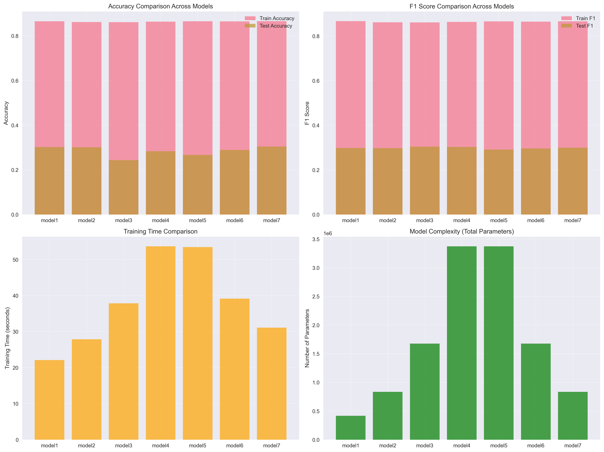
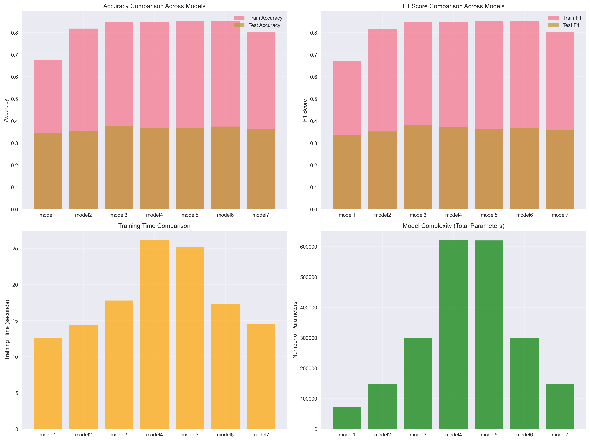
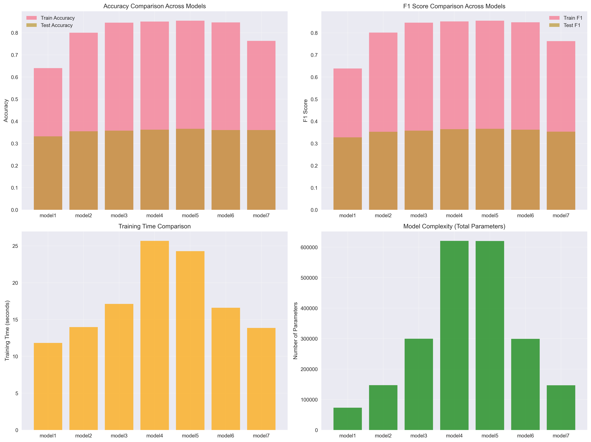
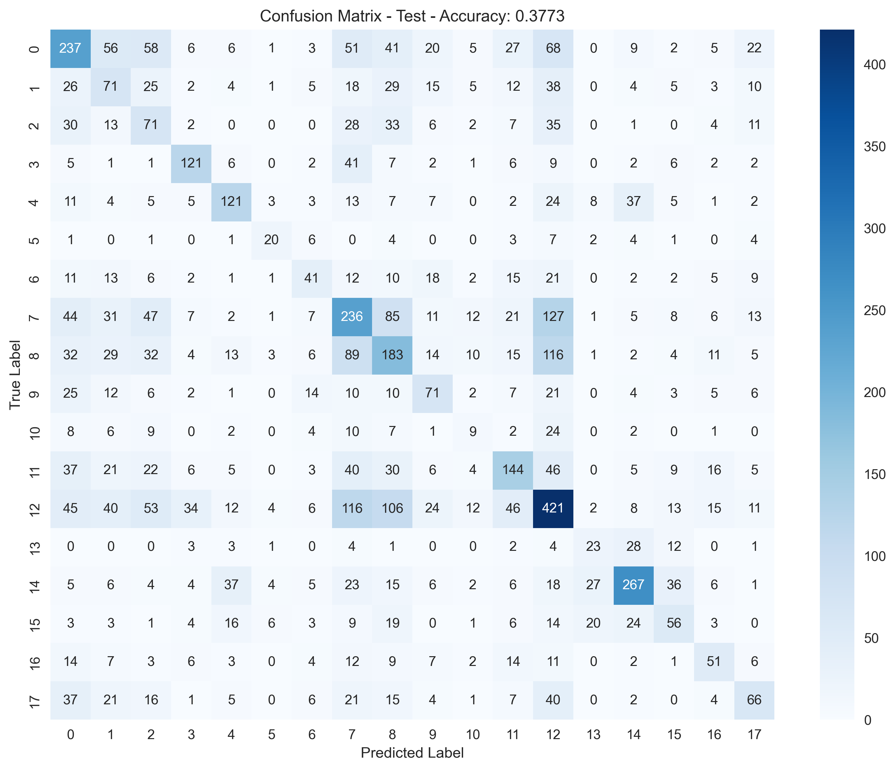
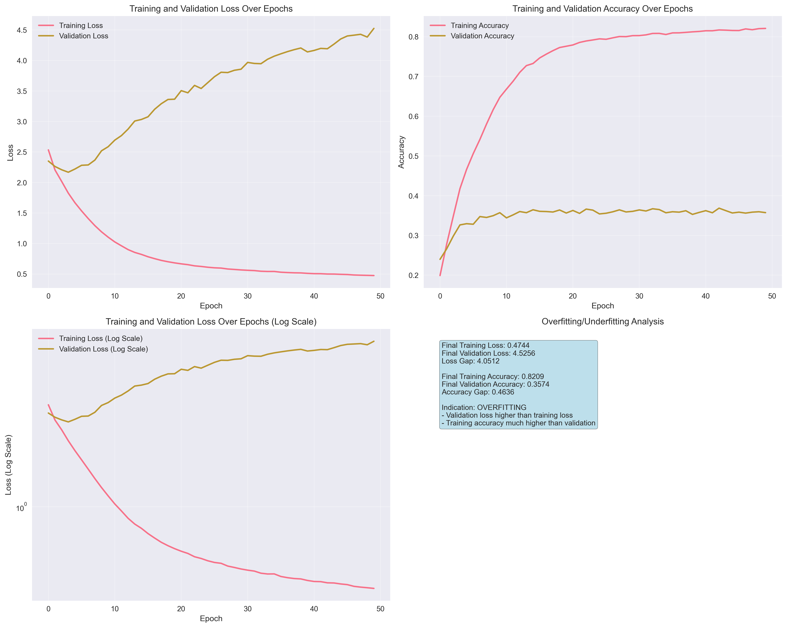

# Project Findings

## Project Thinking and Approaches (Reflection)

Before starting this project, I read through it and thought it was going to be a simple one. I tried watching the video explaining the project, but I couldn't really understand the true purpose behind it. Honestly, I still don’t know if I’ve captured the real intention even now. But this time, I tried to go through the code line by line and understand it as much as I could. A lot of it felt unfamiliar to me since I’ve never done this kind of NLP project before.

While working on it, I noticed there were some functions and import statements that were included but never used. I feel like these might be hints about what’s expected in the project. From that, I learned about something called a vectorizer, which is kind of like one-hot encoding but better suited for text. It also helps make things more efficient, cutting down the number of things the computer has to process by around 82%. Even though the final results weren’t that great, I think there’s still room to improve the model’s accuracy and performance.

Just like I did in Project 1, I tried training the model with different architectures. But this time, I focused more on the preprocessing steps instead of tuning the training methods. I also tried to produce the confusion matrix, training history, and model comparisons graphs to better visualzied the findings. 

I also realized that every single line of code comes from a much bigger concept, and I still don’t fully understand those basics. I’ve been watching the teacher’s ML playlist to try and fill in those gaps because I know I still have a lot to catch up on. But I’m learning a lot through this NLP process, and I hope I can keep discussing and exploring these ideas to help me understand them better.

## Executive Summary

In this report I have compared the results of three feature engineering approaches: One-Hot Encoding, Count Vectorizer, and TF-IDF Vectorizer across various model architectures. 

---

## Model 1: [32 → 16 → 18]

| Metric | One-Hot | Count Vectorizer | TF-IDF | Best Approach |
|--------|---------|------------------|--------|---------------|
| **Total Parameters** | 416,962 | 72,930 | 72,930 | **Count/TF-IDF** |
| **Train Accuracy** | 86.56% | 67.40% | 63.99% | One-Hot |
| **Test Accuracy** | 30.25% | 34.44% | 33.16% | **Count Vectorizer** |
| **Train Precision** | 87.18% | 68.37% | 65.11% | One-Hot |
| **Test Precision** | 50.45% | 35.15% | 34.37% | **One-Hot** |
| **Train Recall** | 86.56% | 67.40% | 63.99% | One-Hot |
| **Test Recall** | 30.25% | 34.44% | 33.16% | **Count Vectorizer** |
| **Train F1 Score** | 86.65% | 66.98% | 63.86% | One-Hot |
| **Test F1 Score** | 29.80% | 33.67% | 32.74% | **Count Vectorizer** |
| **Training Time** | 22.1s | 12.5s | 11.8s | **TF-IDF** |
| **Overfitting Gap** | 56.3% | 33.0% | 30.8% | **TF-IDF** |

---

## Model 2: [64 → 32 → 16 → 18]

| Metric | One-Hot | Count Vectorizer | TF-IDF | Best Approach |
|--------|---------|------------------|--------|---------------|
| **Total Parameters** | 835,170 | 147,106 | 147,106 | **Count/TF-IDF** |
| **Train Accuracy** | 86.20% | 81.85% | 79.99% | One-Hot |
| **Test Accuracy** | 30.13% | 35.53% | 35.46% | **Count Vectorizer** |
| **Train Precision** | 86.49% | 82.15% | 80.98% | One-Hot |
| **Test Precision** | 48.78% | 35.85% | 36.41% | **TF-IDF** |
| **Train Recall** | 86.20% | 81.85% | 79.99% | One-Hot |
| **Test Recall** | 30.13% | 35.53% | 35.46% | **Count Vectorizer** |
| **Train F1 Score** | 86.17% | 81.76% | 80.07% | One-Hot |
| **Test F1 Score** | 29.77% | 35.23% | 35.26% | **TF-IDF** |
| **Training Time** | 27.9s | 14.4s | 14.0s | **TF-IDF** |
| **Overfitting Gap** | 56.1% | 46.3% | 44.5% | **TF-IDF** |

---

## Model 3: [128 → 64 → 32 → 16 → 18]

| Metric | One-Hot | Count Vectorizer | TF-IDF | Best Approach |
|--------|---------|------------------|--------|---------------|
| **Total Parameters** | 1,675,682 | 299,554 | 299,554 | **Count/TF-IDF** |
| **Train Accuracy** | 86.14% | 84.65% | 84.57% | One-Hot |
| **Test Accuracy** | 24.39% | 37.73% | 35.74% | **Count Vectorizer** |
| **Train Precision** | 86.57% | 85.27% | 84.96% | One-Hot |
| **Test Precision** | 53.99% | 38.71% | 36.94% | **One-Hot** |
| **Train Recall** | 86.14% | 84.65% | 84.57% | One-Hot |
| **Test Recall** | 24.39% | 37.73% | 35.74% | **Count Vectorizer** |
| **Train F1 Score** | 86.12% | 84.81% | 84.54% | One-Hot |
| **Test F1 Score** | 30.43% | 38.02% | 35.76% | **Count Vectorizer** |
| **Training Time** | 37.9s | 17.8s | 17.1s | **TF-IDF** |
| **Overfitting Gap** | 61.8% | 46.9% | 48.8% | **Count Vectorizer** |

---

## Model 4: [256 → 128 → 64 → 32 → 16 → 18]

| Metric | One-Hot | Count Vectorizer | TF-IDF | Best Approach |
|--------|---------|------------------|--------|---------------|
| **Total Parameters** | 3,373,090 | 620,834 | 620,834 | **Count/TF-IDF** |
| **Train Accuracy** | 86.35% | 84.93% | 85.06% | One-Hot |
| **Test Accuracy** | 28.36% | 36.90% | 36.23% | **Count Vectorizer** |
| **Train Precision** | 86.64% | 85.53% | 85.74% | One-Hot |
| **Test Precision** | 52.06% | 38.41% | 38.19% | **One-Hot** |
| **Train Recall** | 86.35% | 84.93% | 85.06% | One-Hot |
| **Test Recall** | 28.36% | 36.90% | 36.23% | **Count Vectorizer** |
| **Train F1 Score** | 86.32% | 84.99% | 85.15% | One-Hot |
| **Test F1 Score** | 30.31% | 37.21% | 36.43% | **Count Vectorizer** |
| **Training Time** | 53.7s | 26.1s | 25.7s | **TF-IDF** |
| **Overfitting Gap** | 58.0% | 48.0% | 48.8% | **Count Vectorizer** |

---

## Model 5: [256 → 128 → 64 → 32 → 18]

| Metric | One-Hot | Count Vectorizer | TF-IDF | Best Approach |
|--------|---------|------------------|--------|---------------|
| **Total Parameters** | 3,372,850 | 620,594 | 620,594 | **Count/TF-IDF** |
| **Train Accuracy** | 86.56% | 85.39% | 85.42% | One-Hot |
| **Test Accuracy** | 26.73% | 36.68% | 36.61% | **Count Vectorizer** |
| **Train Precision** | 86.81% | 85.74% | 85.94% | One-Hot |
| **Test Precision** | 47.30% | 37.49% | 38.09% | **TF-IDF** |
| **Train Recall** | 86.56% | 85.39% | 85.42% | One-Hot |
| **Test Recall** | 26.73% | 36.68% | 36.61% | **Count Vectorizer** |
| **Train F1 Score** | 86.54% | 85.40% | 85.44% | One-Hot |
| **Test F1 Score** | 29.14% | 36.45% | 36.63% | **TF-IDF** |
| **Training Time** | 53.5s | 25.2s | 24.3s | **TF-IDF** |
| **Overfitting Gap** | 59.8% | 48.7% | 48.8% | **Count Vectorizer** |

---

## Model 6: [128 → 64 → 32 → 18]

| Metric | One-Hot | Count Vectorizer | TF-IDF | Best Approach |
|--------|---------|------------------|--------|---------------|
| **Total Parameters** | 1,675,442 | 299,314 | 299,314 | **Count/TF-IDF** |
| **Train Accuracy** | 86.48% | 85.15% | 84.68% | One-Hot |
| **Test Accuracy** | 28.92% | 37.46% | 36.04% | **Count Vectorizer** |
| **Train Precision** | 87.12% | 85.46% | 84.97% | One-Hot |
| **Test Precision** | 48.58% | 37.62% | 37.54% | **One-Hot** |
| **Train Recall** | 86.48% | 85.15% | 84.68% | One-Hot |
| **Test Recall** | 28.92% | 37.46% | 36.04% | **Count Vectorizer** |
| **Train F1 Score** | 86.43% | 85.14% | 84.71% | One-Hot |
| **Test F1 Score** | 29.64% | 36.91% | 36.20% | **Count Vectorizer** |
| **Training Time** | 39.2s | 17.4s | 16.6s | **TF-IDF** |
| **Overfitting Gap** | 57.6% | 47.7% | 48.6% | **Count Vectorizer** |

---

## Model 7: [64 → 32 → 18]

| Metric | One-Hot | Count Vectorizer | TF-IDF | Best Approach |
|--------|---------|------------------|--------|---------------|
| **Total Parameters** | 834,930 | 146,866 | 146,866 | **Count/TF-IDF** |
| **Train Accuracy** | 86.57% | 80.43% | 76.31% | One-Hot |
| **Test Accuracy** | 30.47% | 36.18% | 36.06% | **Count Vectorizer** |
| **Train Precision** | 87.21% | 81.27% | 77.46% | One-Hot |
| **Test Precision** | 49.93% | 37.32% | 36.76% | **One-Hot** |
| **Train Recall** | 86.57% | 80.43% | 76.31% | One-Hot |
| **Test Recall** | 30.47% | 36.18% | 36.06% | **Count Vectorizer** |
| **Train F1 Score** | 86.62% | 80.42% | 76.20% | One-Hot |
| **Test F1 Score** | 29.96% | 35.83% | 35.33% | **Count Vectorizer** |
| **Training Time** | 31.1s | 14.6s | 13.9s | **TF-IDF** |
| **Overfitting Gap** | 56.1% | 44.3% | 40.3% | **TF-IDF** |

---

## Overall Performance Summary

### Best Performers

| Metric | Best Model | Value | Approach |
|--------|------------|-------|----------|
| **Highest Test Accuracy** | Model 3 | 37.73% | Count Vectorizer |
| **Highest Test F1** | Model 3 | 38.02% | Count Vectorizer |
| **Highest Test Precision** | Model 1 | 50.45% | One-Hot |
| **Highest Test Recall** | Model 3 | 37.73% | Count Vectorizer |
| **Fastest Training** | Model 1 | 11.8s | TF-IDF |
| **Least Overfitting** | Model 1 | 30.8% gap | TF-IDF |
| **Most Parameters** | Model 4/5 | 3.37M | One-Hot |
| **Fewest Parameters** | Model 1 | 72,930 | Count/TF-IDF |

### Detailed Metrics Analysis

#### Charts for each iteration of three different preprocessing approaches
One-Hot Encoding Results:

Count Vectorizer Results:

TF-IDF Results:

#### Train vs Test Performance
- **One-Hot Encoding**: Consistently high training performance (86-87%) but have poor performance in test data (24-30% test accuracy).
- **Count Vectorizer**: Balanced performance with reasonable training accuracy (67-85%) and best test results (34-38%).
- **TF-IDF**: Similar to Count Vectorizer but slightly lower training accuracy (64-85%) with comparable test performance.
- Text-based approaches perform worst when the model goes from 32 -> 16 -> 18 (model1) compared to 64 -> 32 -> 18 (model7), which I think it is because narrowing down gives me optimal performance for this case. The same is not true for one-hot encoding.

#### Precision vs Recall Trade-offs
- **One-Hot models** showed higher precision but lower recall on test data but performance dropped as the model architecture become complex.
- **Text-based approaches** achieved better balance between precision and recall even though the gap is still there.
- **Model 3** with Count Vectorizer provided optimal precision-recall balance result.

### Key Findings

#### 1. Feature Engineering Impact
- **Parameter Reduction**: Text-based approaches (Count Vectorizer/TF-IDF) reduced parameters by ~82% compared to one-hot encoding.
- **Performance Improvement**: Count Vectorizer made ~7% improvement over one-hot encoding.
- **Training Efficiency**: Text-based approaches trained 2-3x faster due to reduced parameter counts.

#### 2. Architecture Analysis
- **Optimal Complexity**: Model 3 (5 layers, ~300K parameters) provided the best balance of performance vs complexity.
- **Diminishing Returns**: Beyond Model 3, additional layers showed minimal performance gains while increasing overfitting. It holds true for especially for one-hot encoding method as its test performance dropped as the model becomes complex.
- **Consistency**: Count Vectorizer maintained better test accuracy across all architectures compared to one-hot encoding.

#### 3. Overfitting Patterns
- **One-Hot Encoding**: ~60% gap
- **Count Vectorizer**: ~50% gap
- **TF-IDF**: ~50% gap

Best all-around model, model 3, from this experiement that is preprocessed with Count Vectorizer.

The confusion-matrix shows very poor performance even though it is the best model in this experiment.

Training history which shows the huge loss and accuracy gaps indicating overfitting.

#### 4. Text Processing Comparison
- **Count Vectorizer vs TF-IDF**: Minimal difference in performance (37.73% vs 36.61% best accuracy)
- **Myanmar Location Names**: Simple word counting proved as effective as TF-IDF weighting.
- **Reasoning**: This might be because the village/town names are already unique with very minimal combinations of words. According to what I have read, TF-IDF's effective shown only in very large text-based.

### Conclusion

1. **Use Count Vectorizer** for optimal test accuracy and reasonable training time
2. **Choose Model 3 architecture** (128→64→32→16→18) for best performance-complexity balance
3. **Avoid one-hot encoding**

This analysis shows that feature engineering is more impactful than model complexity in text classification tasks. The 82% reduction in parameters achieved through proper text preprocessing, along with better generalization performance, shows the importance of proper data preparation in these tasks. While there may still be many other methods for further improvement, within the scope of this project, Count Vectorizer is the most effective method. One-hot encoding, on the other hand, should be avoided due to its computational cost.